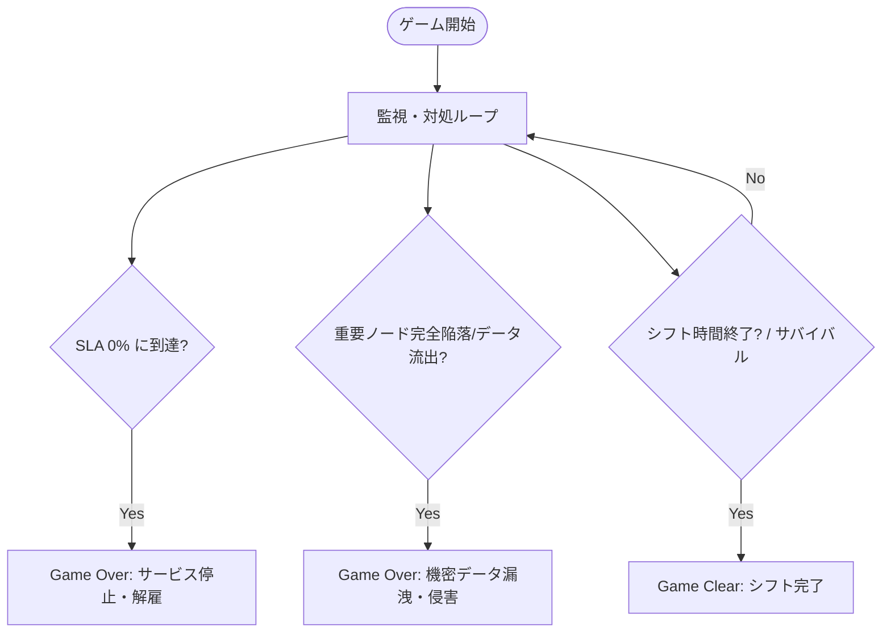

# システム・ゲーム要件定義書 (Requirements Specification)

**プロジェクト名**: Cyber SOC: Night Shift (仮称)  
**リポジトリ**: `unity-2d-game`  
**作成日**: 2026-09-12  
**開発体制**: ゲームクリエイトサークル / ウォーターフォール開発  
**開発環境**: Unity 6 (`6000.3.12f1`) / C# / Universal Render Pipeline (URP)  

---

## 1. プロジェクト概要・背景 (Project Background)

### 1.1 制作目的 (Purpose)
本プロジェクトは、ネットワーク通信およびサイバーセキュリティの基礎知識（IP/ポート、DoS/DDoS、マルウェア拡散、ブルートフォース攻撃、SLA・可用性の重要性）を、ゲームプレイを通じて直感的かつスリリングに学習・体験できる2D監視防衛ゲームの開発を目的とする。

### 1.2 コア体験 (Core Experience)
- **「FNaF」×「SOC (Security Operations Center) 監視員」**:  
  深夜の監視端末（コンソール）とネットワークトポロジーマップを切り替えながら、リアルタイムに迫り来るサイバー脅威を早期発見・対処する緊張感。
- **セキュリティと可用性のトレードオフ（SLAジレンマ）**:  
  脅威を恐れて何でも遮断・隔離すると、正規トラフィックも止まりSLA（稼働率）が低下してゲームオーバーになる。的確な判断と迅速なオペレーションが求められる。

---

## 2. ターゲットユーザーと教育的目標

| 項目 | 内容 |
| :--- | :--- |
| **ターゲット層** | サークルメンバー、学園祭来場者、IT・セキュリティ初学者、インディーゲームファン |
| **前提知識** | 不要（直感的なUIと警告色・ログでプレイ可能） |
| **学習効果** | - サイバー攻撃の典型的な兆候（トラフィック急増、ポート不正アクセス、認証連打）の理解 - 「防御とサービス継続（SLA）」の両立の難しさの体感 - ファイアウォール・ノード隔離・レートリミットなどの役割の理解 |

---

## 3. ゲームシステム・モード要件

### 3.1 ゲームモード (Game Modes)
プレイヤーはタイトル画面から以下の2つのモードを選択可能とする。

1. **サバイバル制 (Survival Shift Mode)**
   - **概要**: 規定のシフト時間（例: 深夜 00:00 〜 06:00）を生き残ることでステージクリア。
   - **難易度曲線**: 時間経過とともに脅威の種類が増加・複合化する。
   - **クリア条件**: シフト終了時刻までSLAおよびコアサーバーの防衛に成功すること。

2. **スコアアタック制 (Endless / Score Attack Mode)**
   - **概要**: ゲームオーバーになるまで攻撃が激化し続けるエンドレスモード。
   - **評価基準**: 生存時間、高SLA維持率、正確な防御成功回数（誤遮断ペナルティあり）から総合スコアを算出。

### 3.2 勝敗条件 (Win / Loss Conditions)

- **敗北条件 (Game Over)**:
  1. **SLA破綻**: 誤遮断や放置による遅延で稼働率（SLAゲージ）が 0% に到達。
  2. **コア侵害**: 最深部の重要ノード（データベース/メインサーバー）がマルウェアまたは攻撃者に完全掌握される。
- **勝利条件 (Game Clear)**:
  - サバイバルモードにおいて、SLA・コアサーバーを維持したまま 06:00 を迎える。

---

## 4. 機能要件 (Functional Requirements)

### 4.1 画面・UIシステム (Display & View Switching)
- **マルチスクリーン切替機構**:
  - **Main Console (メイン端末)**: 総合ステータス、SLAメーター、アラートログ、シフト時計の表示。
  - **Network Topology Map (ノード監視マップ)**: Firewall → DMZ → Web Server → App Server → Database の接続図。ノード状態（正常/警戒/感染/隔離/ダウン）をリアルタイム表示。
  - **Traffic & Port Monitor (トラフィック監視)**: 帯域使用率グラフ、主要ポート（80/443/22/3389等）の通信量メーター。
  - **Access / Auth Log (認証ログ端末)**: ログイン試行ログ、IPアドレス一覧、ブラックリスト操作。
- **レトロサイバーUI演出**:
  - CRT走査線、グリッチエフェクト、緑/シアンの発光パレット、警告時アラート演出。

### 4.2 脅威システム (Threat System)
初期リリースでは代表的な3〜4種の脅威を実装し、それぞれ明確な兆候と専用の対処法を持たせる。

| 脅威タイプ | 予兆・検知方法 | プレイヤーの対処法 | 放置時の被害 |
| :--- | :--- | :--- | :--- |
| **DDoS Attack (大量パケット)** | トラフィックメーター急上昇、回線帯域飽和 | **レートリミット起動** または **CDNキャッシュ適用** | 全ノード遅延、SLA急低下 |
| **Port Scan & Malware (侵入・感染)** | マップ上でノードが順に赤く点滅、侵入アラート | **侵入経路ポート閉鎖** または **中間ノードの論理隔離** | コアサーバー到達でゲームオーバー |
| **Brute Force (総当たり認証)** | 認証ログに同一/分散IPからの高速失敗ログ | **対象IPのブロック** または **MFAチャレンジ強制** | 管理者権限奪取、防御無効化 |
| **Ransomware Worm (拡散)** | ストレージ負荷急増、ノード間感染ラインの伝播 | **感染ノードの即時電源切断/復旧** | 周辺ノードへ連鎖感染 |

### 4.3 パラメータ・リソース管理
- **SLA (Service Level Agreement) ゲージ [100% → 0%]**:
  - 攻撃を受けている時間に応じて減少。
  - 正常なユーザー通信を誤って遮断（過剰防御）した場合にもペナルティ減少。
  - 正常運用時間に応じて緩やかに自然回復。
- **ノード健全度 (Health / Integrity)**:
  - 各ノードごとの感染度・耐久値。
- **シフトタイマー**:
  - 00:00 から 06:00 への進行管理。

---

## 5. 非機能要件 (Non-Functional Requirements)

1. **プラットフォーム・解像度**:
   - PC (Windows Standalone) 向け
   - 基準解像度: Full HD (1920x1080, 16:9 アスペクト比対応)
2. **操作体系**:
   - マウス（UIクリック、画面切替タブ操作）
   - キーボードショートカット（数字キー `1`〜`4` で画面切替、スペースで緊急リセット等）
3. **拡張性・設計方針 (Architecture)**:
   - ScriptableObject による脅威データ（出現頻度・パラメータ・被害速度）のデータ駆動設計
   - イベント駆動（C# `event` / `Action`）による疎結合なUI・ロジック分離
   - ステートマシン（Title, ModeSelect, InGame, Paused, Result）による状態管理

---

## 6. 開発マイルストーン (Milestones)

- **Phase 0 (準備 & アーカイブ)**: [完了]
  - 既存プロジェクト（Crash & Hop）の `_Archive_Crash&Hop/` への完全退避
  - 要件定義ドキュメント策定
- **Phase 1 (コアプロトタイプ)**:
  - 基本画面切替UI（メインコンソール・マップ・ログ）の構築
  - 脅威1種（DDoS）と対処（レートリミット）、SLA計算ロジックの実装
- **Phase 2 (脅威拡充 & サバイバル/スコアアタック実装)**:
  - ポートスキャン・総当たり・マルウェア脅威の追加
  - サバイバルモード（シフト制）とスコアアタックモードのルール実装
- **Phase 3 (ビジュアル・オーディオ・ポリッシュ)**:
  - CRT/グリッチシェーダー、警告アラーム音、BGM、リザルト画面の完成
