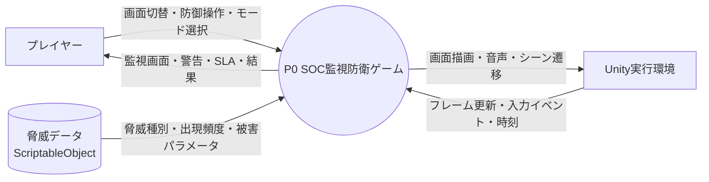
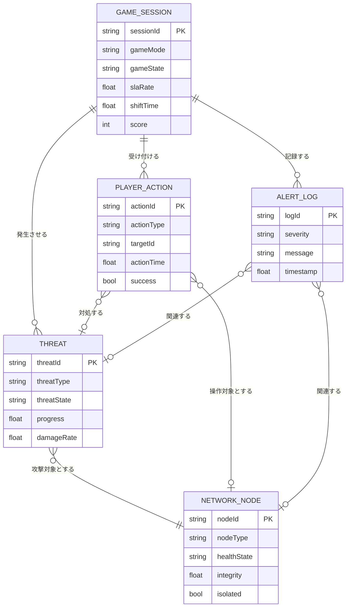
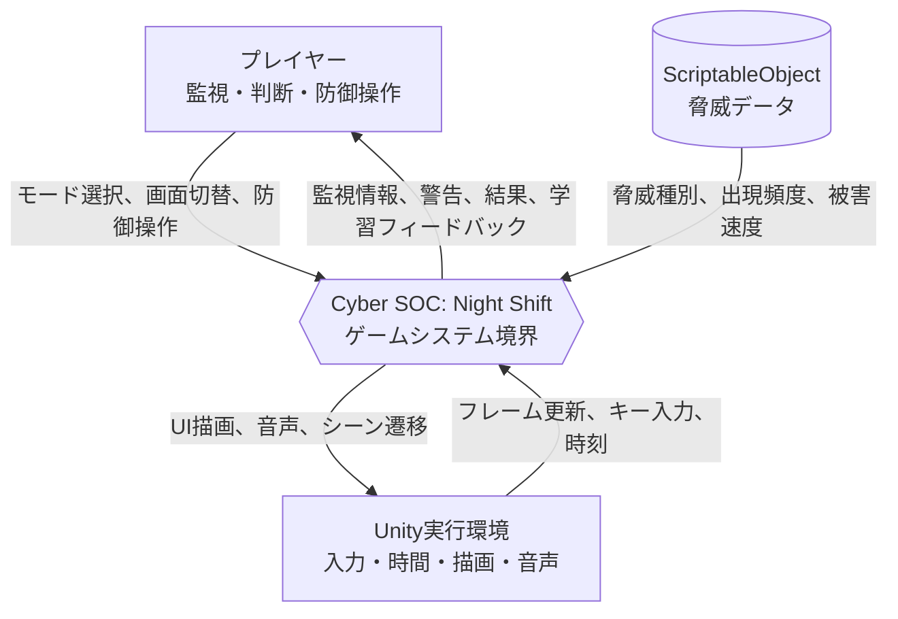
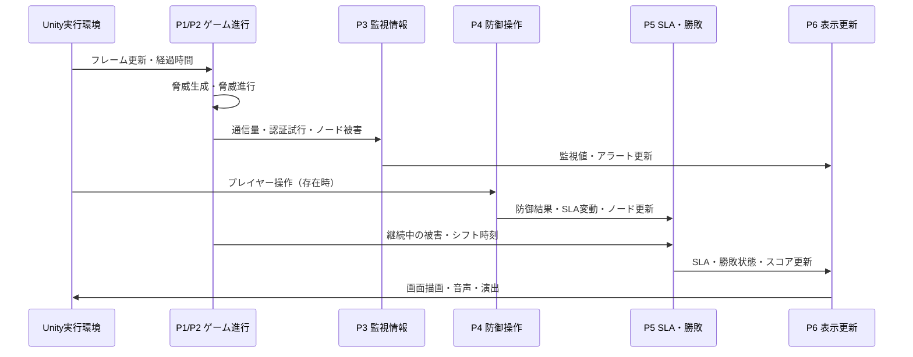

# Unity 2D ゲーム制作 設計書

**プロジェクト名**: Cyber Room 24/7 (仮称)  
**開発体制**: ウォーターフォール開発  
**開発環境**: Unity Hub 3.16.4 / Unity Editor 6000.3.12f1 / C# / VS Code  
**作成日**: 2026/09/12  
**更新日**: 2026/09/29

---

## 1. 概要

### 1.1 制作目的
本プロジェクトは、「通信ネットワークの監視」と「セキュリティ強化（Hardening）」を同時に行う体験を、ゲームプレイを通じて直感的かつスリリングに学習・体験できる2D監視防衛ゲームの開発を目的とする。具体的には、IP/ポート、DoS/DDoS、マルウェア拡散、ブルートフォース攻撃、SLA・可用性の重要性を、ネットワーク伝送と防御設定の両方の観点から理解できる内容とする。

### 1.2 制作目標

## 対象ユーザ

---

## 3. ゲームシステム・モード要件

### 3.1 ゲームモード
プレイヤーはタイトル画面から以下の2つのモードを選択可能とする。

1. **サバイバル制 (Survival Shift Mode)**
   - **概要**: 規定のシフト時間（例: 深夜 00:00 〜 06:00）を生き残ることでステージクリア。
   - **難易度曲線**: 時間経過とともに脅威の種類が増加・複合化する。
   - **クリア条件**: シフト終了時刻までSLAおよびコアサーバーの防衛に成功すること。

2. **スコアアタック制 (Endless / Score Attack Mode)**
   - **概要**: ゲームオーバーになるまで攻撃が激化し続けるエンドレスモード。
   - **評価基準**: 生存時間、高SLA維持率、正確な防御成功回数（誤遮断ペナルティあり）から総合スコアを算出。

### 3.2 勝敗条件

- **敗北条件 (Game Over)**:
  1. **SLA破綻**: 誤遮断や放置による遅延で稼働率（SLAゲージ）が 0% に到達。
  2. **コア侵害**: 最深部の重要ノード（データベース/メインサーバー）がマルウェアまたは攻撃者に完全掌握される。
- **勝利条件 (Game Clear)**:
  - サバイバルモードにおいて、SLA・コアサーバーを維持したまま 06:00 を迎える。

---

## 4. 機能要件

### 4.1 画面・UIシステム
- **マルチスクリーン切替機構**:
  - **Main Console (メイン端末)**: 総合ステータス、SLAメーター、アラートログ、シフト時計の表示。
  - **Network Topology Map (ノード監視マップ)**: Firewall → DMZ → Web Server → App Server → Database の接続図。ノード状態（正常/警戒/感染/隔離/ダウン）をリアルタイム表示。
  - **Traffic & Port Monitor (トラフィック監視)**: 帯域使用率グラフ、主要ポート（80/443/22/3389等）の通信量メーター。
  - **Access / Auth Log (認証ログ端末)**: ログイン試行ログ、IPアドレス一覧、ブラックリスト操作。
  - **Hardening Control Panel (強化設定パネル)**: ファイアウォールルール、レート制限、隔離、MFA強制、復旧操作などのセキュリティ強化アクションを管理するUI。
- **レトロサイバーUI演出**:
  - CRT走査線、グリッチエフェクト、緑/シアンの発光パレット、警告時アラート演出。

### 4.2 脅威システム
初期リリースでは代表的な3〜4種の脅威を実装し、それぞれ明確な兆候と専用の対処法を持たせる。すべての脅威は「通信ネットワークの異常」と「セキュリティの脆弱性」を同時に扱い、プレイヤーは監視からハードニングまで一連の防衛行動を実行する。

| 脅威タイプ | 予兆・検知方法 | プレイヤーの対処法 | 放置時の被害 |
| :--- | :--- | :--- | :--- |
| **DDoS Attack (大量パケット)** | トラフィックメーター急上昇、回線帯域飽和 | **レートリミット起動** または **CDNキャッシュ適用** | 全ノード遅延、SLA急低下 |
| **Port Scan & Malware (侵入・感染)** | マップ上でノードが順に赤く点滅、侵入アラート | **侵入経路ポート閉鎖** または **中間ノードの論理隔離** | コアサーバー到達でゲームオーバー |
| **Brute Force (総当たり認証)** | 認証ログに同一/分散IPからの高速失敗ログ | **対象IPのブロック** または **MFAチャレンジ強制** | 管理者権限奪取、防御無効化 |
| **Ransomware Worm (拡散)** | ストレージ負荷急増、ノード間感染ラインの伝播 | **感染ノードの即時電源切断/復旧** | 周辺ノードへ連鎖感染 |

### 4.3 パラメータ・リソース管理
- **SLA (Service Level Agreement) ゲージ [100% → 0%]**:
  - 攻撃を受けている時間に応じて減少。
  - 正常なユーザー通信を誤って遮断（過剰防御）した場合にもペナルティ減少。
  - 正常運用時間に応じて緩やかに自然回復。
- **ノード健全度 (Health / Integrity)**:
  - 各ノードごとの感染度・耐久値。
- **シフトタイマー**:
  - 00:00 から 06:00 への進行管理。

### 4.4 データフロー図 (DFD0)
ゲーム全体を1つのシステムとして扱い、プレイヤー、ゲーム実行環境、脅威データを外部エンティティとしたコンテキストレベルのデータフローを定義する。

- **入力データ**: プレイヤーのモード選択、画面切替、防御操作、緊急リセット操作、脅威データ、Unityの時間経過および入力イベント。
- **出力データ**: 各監視画面の表示情報、アラートログ、ノード状態、SLAおよびシフト時計、ゲームクリア/ゲームオーバー結果。
- **境界条件**: ゲーム内部の処理はP0に集約し、画面UIはP0の状態を表示する。脅威データはScriptableObjectから読み込み、実行中に直接編集しない。

### 4.5 ERD概念モデル
ゲーム中に扱う主要な概念エンティティと関係を定義する。これは外部データベースの設計ではなく、ゲーム状態、ログ、イベントを整理するための概念モデルである。ここでは、通信経路とセキュリティ強化の両方を管理対象とする。

- **GAME_SESSION**はモード、進行状態、SLA、シフト時刻、スコアを保持する。
- **THREAT**は脅威種別、対象、進行度、被害速度を保持する。脅威パラメータの定義元はScriptableObjectとする。
- **NETWORK_NODE**はFirewall、DMZ、Web Server、App Server、Databaseなどの状態を保持する。
- **PLAYER_ACTION**は防御操作の対象、時刻、成否を記録し、誤操作や正しい対処の評価に利用する。
- **ALERT_LOG**は監視画面に表示する警告・情報を記録する。

### 4.6 コンテキストダイアグラム
システム境界と外部との責務をDFD0より明確にする。プレイヤーは操作と判断を提供し、Unity実行環境は入力・時間・描画基盤を提供し、脅威データはゲームバランスを提供する。

### 4.7 タイミング仕様

#### 1フレームの処理順序

- ゲームがInGame状態のときのみ、脅威進行と防御操作を処理する。
- 1フレーム内では、脅威進行、監視情報集約、防御操作、SLA・勝敗判定、表示更新の順に評価する。
- 同一フレームで複数の防御操作が入力された場合は、入力受付順に処理する。
- Pause中はシフト時計、脅威進行、SLA変動を停止し、画面操作は再開または終了に限定する。
- ResultまたはGame Over遷移後は、脅威生成と防御操作を停止し、結果表示だけを更新する。

#### 時間・応答基準

| 項目 | 仕様 |
| :--- | :--- |
| シフト時間 | Survivalではゲーム内00:00から06:00までを1シフトとする。実時間への換算値はゲームバランス設定で変更可能とする。 |
| 脅威生成 | P2が経過時間と難易度曲線を参照し、設定された出現間隔で生成する。 |
| 入力反映 | 有効なプレイヤー操作は受け付けたフレーム内に対象状態へ反映する。 |
| 勝敗判定 | 防御操作後および各フレームの状態更新後に実施する。 |
| 表示更新 | SLA、ノード状態、アラート、シフト時計は状態変更時またはフレーム更新時に表示へ反映する。 |

### 4.8 画面設計

| 画面ID | 画面名 | 主な表示 | 主な操作 | 遷移先 |
| :--- | :--- | :--- | :--- | :--- |
| S-01 | Title | ゲームタイトル、開始、終了 | 開始、終了 | S-02、終了 |
| S-02 | Mode Select | Survival、Score Attack、操作説明 | モード選択、決定 | S-03 |
| S-03 | Main Console | SLA、シフト時計、現在アラート、主要ノード状態 | 画面切替、緊急リセット、Pause | S-04〜S-06、S-07 |
| S-04 | Network Topology Map | FirewallからDatabaseまでの接続、感染度、隔離状態 | ポート閉鎖、ノード隔離、復旧 | S-03、S-07 |
| S-05 | Traffic & Port Monitor | 帯域使用率、ポート80/443/22/3389の通信量 | レートリミット、CDNキャッシュ | S-03、S-07 |
| S-06 | Access / Auth Log | ログイン試行、IP一覧、認証失敗頻度 | IPブロック、MFA強制 | S-03、S-07 |
| S-07 | Pause / Result | Pauseメニュー、結果、スコア、失敗理由 | 再開、リトライ、Titleへ戻る | S-03、S-01、S-02 |

- 共通ヘッダーにはSLA、シフト時計、現在のゲーム状態を表示する。
- 画面切替はマウス操作と数字キー`1`〜`4`の両方に対応し、選択中の画面を明確に表示する。
- 警告は色だけに依存せず、アイコン、ラベル、アラートログの文言でも状態を伝える。
- 画面設計の基準解像度は1920x1080とし、16:9で主要情報が欠落しないレイアウトにする。

### 4.9 入出力表

| I/O ID | 区分 | 入力元/出力先 | データ | 処理・表示内容 |
| :--- | :--- | :--- | :--- | :--- |
| IO-01 | 入力 | プレイヤー | モード選択 | GameSessionのモードを設定し、初期化する。 |
| IO-02 | 入力 | プレイヤー | 画面切替キー/ボタン | 表示画面を切り替える。 |
| IO-03 | 入力 | プレイヤー | 防御操作と対象 | 操作の妥当性を検証し、脅威・ノード・SLAへ反映する。 |
| IO-04 | 入力 | プレイヤー | Pause/再開/リトライ | ゲーム状態を遷移させる。 |
| IO-05 | 入力 | Unity | 時間、フレーム、キー入力 | ゲーム進行と操作受付の基準にする。 |
| IO-06 | 入力 | ScriptableObject | 脅威パラメータ | 脅威生成と被害計算に利用する。 |
| IO-07 | 出力 | プレイヤー | SLA、シフト時計、ノード状態 | 現在の防衛状況を表示する。 |
| IO-08 | 出力 | プレイヤー | アラートログ、通信量、認証ログ | 脅威の兆候と判断材料を表示する。 |
| IO-09 | 出力 | プレイヤー | 防御結果、SLA変動、操作ログ | 操作の成否と影響をフィードバックする。 |
| IO-10 | 出力 | Unity | UI描画、音声、シーン遷移 | ゲーム状態を実行環境へ反映する。 |
| IO-11 | 出力 | プレイヤー | Game Clear/Game Over、スコア | 終了理由と達成度を表示する。 |

### 4.10 イベントリスト

| イベントID | イベント名 | 発生条件 | 発生元 | 主な購読先/処理 |
| :--- | :--- | :--- | :--- | :--- |
| EVT-01 | GameStarted | モード選択後に開始 | P1 | P2初期化、P6画面遷移 |
| EVT-02 | ThreatSpawned | 脅威生成条件を満たした | P2 | P3監視情報、P6警告表示 |
| EVT-03 | ThreatProgressed | フレーム更新で脅威が進行 | P2 | P3ノード・ログ更新、P5被害計算 |
| EVT-04 | AlertRaised | 監視値が検知閾値を超えた | P3 | P6アラート表示、音声演出 |
| EVT-05 | DefenseRequested | プレイヤーが防御操作を入力 | UI/P4 | P4対象検証、操作結果生成 |
| EVT-06 | DefenseResolved | 防御操作の成否を確定 | P4 | P5 SLA更新、P6操作ログ |
| EVT-07 | NodeStateChanged | 健全度または隔離状態が変化 | P4/P5 | P6マップ表示更新 |
| EVT-08 | SlaChanged | 攻撃、誤遮断、回復でSLAが変化 | P5 | P6 SLA表示、スコア更新 |
| EVT-09 | GamePaused/Resumed | Pauseまたは再開操作 | P1 | P2〜P5処理の停止/再開、P6表示 |
| EVT-10 | GameCleared | Survivalで06:00に到達 | P5 | P6結果表示、入力停止 |
| EVT-11 | GameOver | SLA 0%またはコアノード陥落 | P5 | P6失敗理由表示、入力停止 |
| EVT-12 | GameRestarted | Resultからリトライ | P1 | GameSession再初期化、P2再開 |

---

## 5. 非機能要件

1. **プラットフォーム・解像度**:
   - PC (Windows Standalone) 向け
   - 基準解像度: Full HD (1920x1080, 16:9 アスペクト比対応)
2. **操作体系**:
   - マウス（UIクリック、画面切替タブ操作）
   - キーボードショートカット（数字キー `1`〜`4` で画面切替、スペースで緊急リセット等）
3. **拡張性・設計方針 (Architecture)**:
   - ScriptableObject による脅威データ（出現頻度・パラメータ・被害速度）のデータ駆動設計
   - イベント駆動（C# `event` / `Action`）による疎結合なUI・ロジック分離
   - ステートマシン（Title, ModeSelect, InGame, Paused, Result）による状態管理
4. **性能**:
  - 基準解像度1920x1080のWindows Standalone環境で、通常プレイ中に30fps以上を維持する。
  - 画面切替、防御操作、Pause操作に対する入力応答を、通常状態では100ms以内に画面へ反映する。
  - 同時に表示するアラートログは直近50件までとし、古いログは表示対象から外してメモリ使用量の増加を抑える。
5. **信頼性・整合性**:
  - SLA、ノード健全度、脅威進行度、勝敗状態は同一フレーム内で矛盾しないように更新する。
  - Game ClearまたはGame Over後に、脅威生成、防御操作、SLA変動が発生しないこと。
  - 不正な対象IDや無効な状態からの防御操作は無視し、ゲーム状態を破壊しない。
6. **操作性・アクセシビリティ**:
  - 主要な情報を色だけで表現せず、ラベル、アイコン、ログ文言のいずれかを併用する。
  - すべての主要画面をマウス操作で利用でき、画面切替は数字キー`1`〜`4`でも実行できる。
  - 操作対象、対象ノード、操作結果を画面上で確認できる。
7. **保守性・テスト容易性**:
  - 脅威パラメータをコード変更なしにScriptableObjectで調整できる。
  - P1〜P6の責務を分離し、脅威進行、SLA計算、勝敗判定を個別にテスト可能にする。
  - 重要な状態変更をイベントとして記録し、ログから再現条件を確認できるようにする。
8. **セキュリティ・安全性**:
  - 本ゲームは教育用シミュレーションであり、実ネットワークへの接続、実ホストへの攻撃、防御操作は行わない。
  - IPアドレス、ポート、攻撃ログはゲーム内の架空データとして扱い、実在する個人情報や認証情報を収集しない。
9. **互換性・配布**:
  - Unity 6 (`6000.3.12f1`)で開発・検証し、Windows Standaloneビルドで起動できること。
  - 16:9の画面比率で主要UIが重ならず、基準解像度以外では可能な範囲でアスペクト比を維持する。

---

## 6. スコープ

### 6.1. インスコープ

- Windows Standalone向けの2D監視防衛ゲーム本体。
- Title、Mode Select、Main Console、Network Topology Map、Traffic & Port Monitor、Access / Auth Log、Pause / Resultの画面。
- Survival Shift ModeとScore Attack Modeの2モード。
- DDoS、Port Scan & Malware、Brute Force、Ransomware Wormの4種類の脅威と、それぞれの検知兆候・専用対処。
- SLA、ノード健全度、シフトタイマー、スコア、誤遮断ペナルティ、ゲームクリア/ゲームオーバー判定。
- ScriptableObjectによる脅威データ、P1〜P6のプロセス分離、イベント通知、基本的なログ表示。
- マウス操作、数字キー`1`〜`4`による画面切替、スペースキーによる緊急リセットなどの主要操作。
- CRT走査線、警告表示、基本的な効果音とBGMによる監視端末の演出。

### 6.2 アウトスコープ

- 実ネットワーク、外部サーバー、オンラインランキング、マルチプレイヤー通信。
- 実在するIPアドレス、認証情報、個人情報の収集・送信・保存。
- 自由なステージエディター、ユーザー作成脅威、Mod機能。
- 3D表示、モバイル版、コンソール版、VR対応。
- 本格的なIDS/IPSや実運用向けセキュリティ製品としての検知精度。
