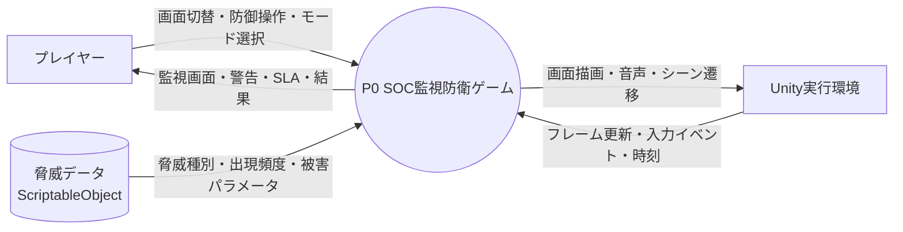
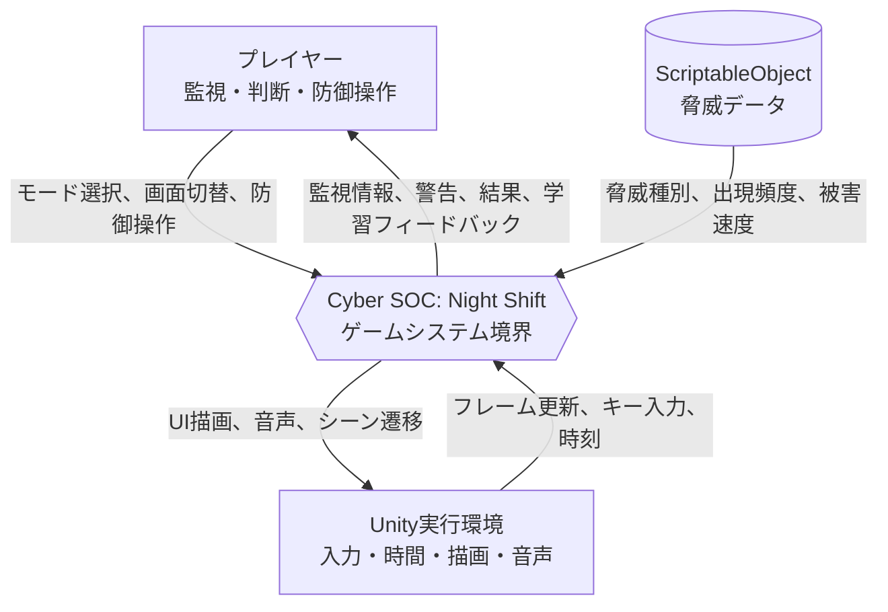

# Unity 2Dゲーム制作 設計書

**プロジェクト名**: Cyber Room 24/7 (仮称)  
**開発環境**: Unity Hub 3.16.4 / Unity Editor 6000.3.12f1 / C# / VS Code  
**作成日**: 2026/09/12  
**更新日**: 2026/10/06

---

## 1. 概要

---

## 2. ゲームシステム・モード要件

### 2.1. ゲームモード
プレイヤーはタイトル画面から以下の2つのモードを選択可能とする。

1. **サバイバル制 (Survival Shift Mode)**
   - **概要**: 規定のシフト時間（例: 深夜 00:00 〜 06:00）を生き残ることでステージクリア。
   - **難易度曲線**: 時間経過とともに脅威の種類が増加・複合化する。
   - **クリア条件**: シフト終了時刻までSLAおよびコアサーバーの防衛に成功すること。

2. **スコアアタック制 (Endless / Score Attack Mode)**
   - **概要**: ゲームオーバーになるまで攻撃が激化し続けるエンドレスモード。
   - **評価基準**: 生存時間、高SLA維持率、正確な防御成功回数（誤遮断ペナルティあり）から総合スコアを算出。

---

## 3. 機能要件

### 3.1. 画面・UIシステム
- **マルチスクリーン切替機構**:
  - **Main Console (メイン端末)**: 総合ステータス、SLAメーター、アラートログ、シフト時計の表示。
  - **Network Topology Map (ノード監視マップ)**: Firewall → DMZ → Web Server → App Server → Database の接続図。ノード状態（正常/警戒/感染/隔離/ダウン）をリアルタイム表示。
  - **Traffic & Port Monitor (トラフィック監視)**: 帯域使用率グラフ、主要ポート（80/443/22/3389等）の通信量メーター。
  - **Access / Auth Log (認証ログ端末)**: ログイン試行ログ、IPアドレス一覧、ブラックリスト操作。
  - **Hardening Control Panel (強化設定パネル)**: ファイアウォールルール、レート制限、隔離、MFA強制、復旧操作などのセキュリティ強化アクションを管理するUI。
- **レトロサイバーUI演出**:
  - CRT走査線、グリッチエフェクト、緑/シアンの発光パレット、警告時アラート演出。

### 3.2. 脅威システム
初期リリースでは代表的な3〜4種の脅威を実装し、それぞれ明確な兆候と専用の対処法を持たせる。すべての脅威は「通信ネットワークの異常」と「セキュリティの脆弱性」を同時に扱い、プレイヤーは監視からハードニングまで一連の防衛行動を実行する。

| 脅威タイプ | 予兆・検知方法 | プレイヤーの対処法 | 放置時の被害 |
| :--- | :--- | :--- | :--- |
| **DDoS Attack (大量パケット)** | トラフィックメーター急上昇、回線帯域飽和 | **レートリミット起動** または **CDNキャッシュ適用** | 全ノード遅延、SLA急低下 |
| **Port Scan & Malware (侵入・感染)** | マップ上でノードが順に赤く点滅、侵入アラート | **侵入経路ポート閉鎖** または **中間ノードの論理隔離** | コアサーバー到達でゲームオーバー |
| **Brute Force (総当たり認証)** | 認証ログに同一/分散IPからの高速失敗ログ | **対象IPのブロック** または **MFAチャレンジ強制** | 管理者権限奪取、防御無効化 |
| **Ransomware Worm (拡散)** | ストレージ負荷急増、ノード間感染ラインの伝播 | **感染ノードの即時電源切断/復旧** | 周辺ノードへ連鎖感染 |

### 3.3. パラメータ・リソース管理
- **SLA (Service Level Agreement) ゲージ [100% → 0%]**:
  - 攻撃を受けている時間に応じて減少。
  - 正常なユーザー通信を誤って遮断（過剰防御）した場合にもペナルティ減少。
  - 正常運用時間に応じて緩やかに自然回復。
- **ノード健全度 (Health / Integrity)**:
  - 各ノードごとの感染度・耐久値。
- **シフトタイマー**:
  - 00:00 から 06:00 への進行管理。

### 3.4. データフロー図 (DFD0)
ゲーム全体を1つのシステムとして扱い、プレイヤー、ゲーム実行環境、脅威データを外部エンティティとしたコンテキストレベルのデータフローを定義する。

- **入力データ**: プレイヤーのモード選択、画面切替、防御操作、緊急リセット操作、脅威データ、Unityの時間経過および入力イベント。
- **出力データ**: 各監視画面の表示情報、アラートログ、ノード状態、SLAおよびシフト時計、ゲームクリア/ゲームオーバー結果。
- **境界条件**: ゲーム内部の処理はP0に集約し、画面UIはP0の状態を表示する。脅威データはScriptableObjectから読み込み、実行中に直接編集しない。

### 3.5. コンテキストダイアグラム
システム境界と外部との責務をDFD0より明確にする。プレイヤーは操作と判断を提供し、Unity実行環境は入力・時間・描画基盤を提供し、脅威データはゲームバランスを提供する。

---

## 4. 非機能要件

1. **プラットフォーム・解像度**:
   - PC (Windows Standalone) 向け
   - 基準解像度: Full HD (1920x1080, 16:9 アスペクト比対応)
2. **操作体系**:
   - マウス（UIクリック、画面切替タブ操作）
   - キーボードショートカット（数字キー `1`〜`4` で画面切替、スペースで緊急リセット等）
3. **拡張性・設計方針 (Architecture)**:
   - ScriptableObject による脅威データ（出現頻度・パラメータ・被害速度）のデータ駆動設計
   - イベント駆動（C# `event` / `Action`）による疎結合なUI・ロジック分離
   - ステートマシン（Title, ModeSelect, InGame, Paused, Result）による状態管理
4. **性能**:
  - 基準解像度1920x1080のWindows Standalone環境で、通常プレイ中に30fps以上を維持する。
  - 画面切替、防御操作、Pause操作に対する入力応答を、通常状態では100ms以内に画面へ反映する。
  - 同時に表示するアラートログは直近50件までとし、古いログは表示対象から外してメモリ使用量の増加を抑える。
5. **信頼性・整合性**:
  - SLA、ノード健全度、脅威進行度、勝敗状態は同一フレーム内で矛盾しないように更新する。
  - Game ClearまたはGame Over後に、脅威生成、防御操作、SLA変動が発生しないこと。
  - 不正な対象IDや無効な状態からの防御操作は無視し、ゲーム状態を破壊しない。
6. **操作性・アクセシビリティ**:
  - 主要な情報を色だけで表現せず、ラベル、アイコン、ログ文言のいずれかを併用する。
  - すべての主要画面をマウス操作で利用でき、画面切替は数字キー`1`〜`4`でも実行できる。
  - 操作対象、対象ノード、操作結果を画面上で確認できる。
7. **保守性・テスト容易性**:
  - 脅威パラメータをコード変更なしにScriptableObjectで調整できる。
  - P1〜P6の責務を分離し、脅威進行、SLA計算、勝敗判定を個別にテスト可能にする。
  - 重要な状態変更をイベントとして記録し、ログから再現条件を確認できるようにする。
8. **セキュリティ・安全性**:
  - 本ゲームは教育用シミュレーションであり、実ネットワークへの接続、実ホストへの攻撃、防御操作は行わない。
  - IPアドレス、ポート、攻撃ログはゲーム内の架空データとして扱い、実在する個人情報や認証情報を収集しない。
9. **互換性・配布**:
  - Unity 6 (`6000.3.12f1`)で開発・検証し、Windows Standaloneビルドで起動できること。
  - 16:9の画面比率で主要UIが重ならず、基準解像度以外では可能な範囲でアスペクト比を維持する。

---

## 5. スコープ

### 5.1. インスコープ

### 5.2 アウトスコープ
